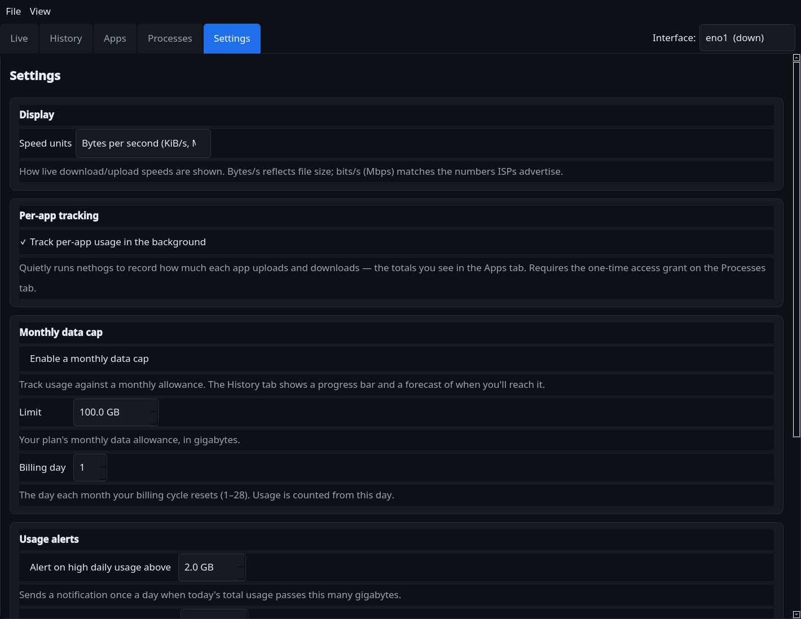
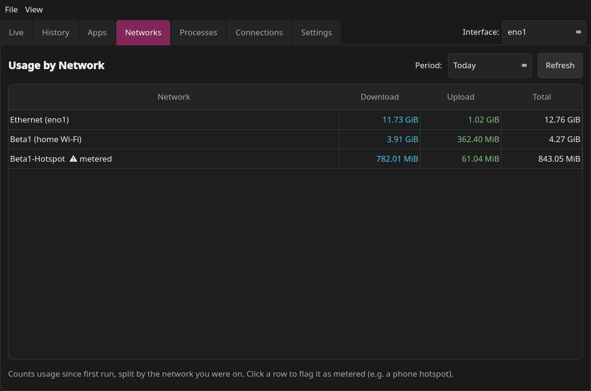
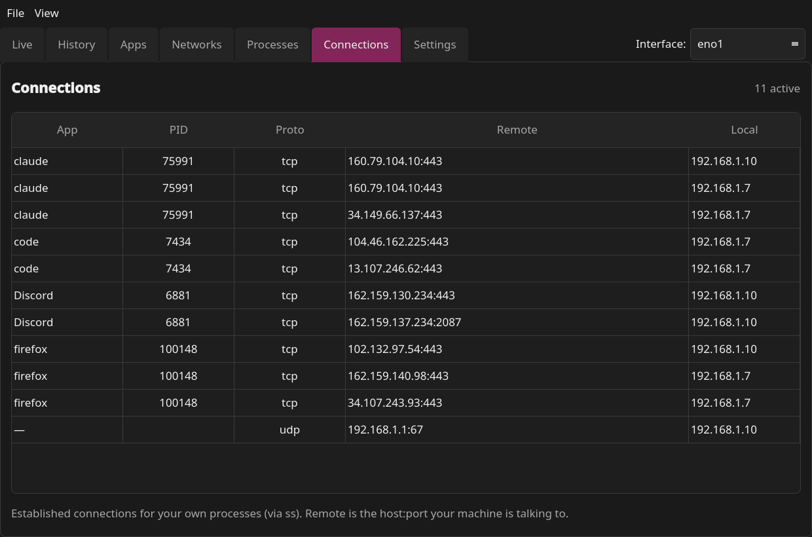
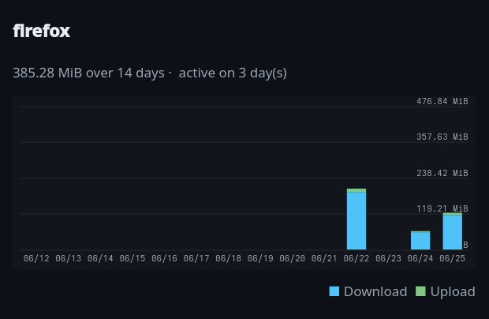

# NetTracker

A PyQt5 desktop app to track internet usage on Linux — **live speed**,
**vnstat history**, **per-app usage**, **monthly data caps**, **usage alerts**,
a **system tray**, and **six color themes**, in a clean UI.

> Charts and the app/tray icon are drawn with `QPainter`, so there are **no
> charting dependencies** — only PyQt5.


## Features

### Monitoring
- **Live** — real-time download/upload speed, a scrolling 60-second graph, and
  session totals. Reads kernel counters from `/sys/class/net`, so **no root
  needed**.
- **History** — today / this-month / all-time totals, plus stacked bar charts
  for **today by hour**, the **last 14 days**, and the **last 12 months**, from
  the `vnstat` database.
- **Apps** — per-app usage **totals** for today / this month. **Double-click any
  app** to open its **14-day daily-usage trend**.
- **Networks** — usage split **per network** (Wi-Fi SSID or wired link), so a
  metered phone hotspot stays separate from home Wi-Fi. Click a row to flag it
  as **metered**.
- **Processes** — live per-process download/upload **rates** via `nethogs`.
- **Connections** — live table of the remote **hosts/ports each app is talking
  to** right now (via `ss`), so you can see who your machine is connecting to.
- **One interface selector** — a single **Interface** dropdown in the tab-bar
  corner drives every tab, including a **Total (all)** option that combines all
  interfaces.

### Budgeting & alerts
- **Monthly data cap** — set a GB limit and billing day. History shows a
  color-coded progress bar (green → amber at 80% → red at 100%) and an
  **end-of-cycle forecast** (*"on pace to hit your cap on Jun 28"*), with
  notifications at 80% and 100% of the cycle.
- **Usage alerts** — get a desktop notification when today's **total**, or any
  single **app**, passes a GB threshold you set.

### Convenience
- **Six themes** — Midnight, Sage, Ocean, Charcoal, Ember, and Ruby; pick one in
  Settings and it applies instantly (charts included).
- **Units toggle** — switch rate display between bytes/s and bits/s (Mbps).
- **Export** — save per-app usage (CSV/JSON) and daily history (CSV).
- **System tray** — live ↓/↑ in the tooltip, close-to-tray, left-click to
  show/hide, optional **launch on login** and **start minimized**.
- **Settings page** — every option on one tab, with a one-line hint under each.
- **Persistent** — remembers your interface, theme, units, cap, alert, and tray
  settings between launches.

> **Per-interface, like vnstat.** Each interface is tracked separately. If the
> numbers look low, check the **Interface** selector — e.g. `wlo1` (Wi-Fi) and
> `eno1` (Ethernet) have independent totals (use **Total (all)** to combine
> them), and a bare `vnstat` shows only your *default* interface.

## Screenshots

| Usage by app | Settings & themes |
|---|---|
|  |  |

<details>
<summary>More — History, Networks, Connections, Processes &amp; per-app trend</summary>







</details>

## Per-app usage (Apps tab)

NetTracker keeps a lightweight `nethogs` sampler running in the background,
integrates each app's rate into bytes, and accumulates it in a local SQLite
database (`~/.local/share/nettracker/usage.db`). Toggle it under
**Settings ▸ Track per-app usage**.

> ⚠️ Per-app tracking only counts traffic **from when tracking starts** — Linux
> keeps no per-process history, so it cannot retroactively split usage that
> already happened. A little traffic (kernel, ICMP) stays unattributed by
> nethogs, so per-app totals run slightly under vnstat's interface total.

## Requirements

- **Python 3.9+** and **PyQt5**
- **`vnstat`** (with its daemon running) — for the History / data-cap features
- **`nethogs`** — for the Apps and Processes tabs (optional)

```bash
# Fedora
sudo dnf install vnstat nethogs
# Debian / Ubuntu
sudo apt install vnstat nethogs
# Arch
sudo pacman -S vnstat nethogs

sudo systemctl enable --now vnstat   # start the vnstat daemon
```

## Install & run

```bash
git clone https://github.com/<you>/NetTracker.git
cd NetTracker

python -m venv venv
source venv/bin/activate
pip install -r requirements.txt

./run.sh          # or: python main.py
```

`run.sh` uses `$PYTHON` if set, otherwise falls back to `python3`.

### Install into the application menu

```bash
./install.sh      # adds a NetTracker entry + icon to your app launcher
./uninstall.sh    # removes it (keeps your data and settings)
```

A [Flatpak manifest](packaging/) is included as a starting point for sandboxed
builds (`flatpak-builder`).

## Per-app / per-process access

`nethogs` needs elevated capabilities to capture packets. The **Apps** and
**Processes** tabs show a **Grant access** button that runs this once via
`pkexec`:

```bash
sudo setcap 'cap_net_admin,cap_net_raw,cap_dac_read_search,cap_sys_ptrace+ep' \
    /usr/bin/nethogs
```

Afterwards NetTracker runs nethogs as your normal user — no `sudo` per launch.

## Menus & shortcuts

| Action | Where |
|--------|-------|
| All settings (theme, units, cap, alerts, tracking, startup) | The **Settings** tab — applied live, with a hint under each |
| Pick the interface | **Interface** dropdown in the tab-bar corner (drives all tabs) |
| Per-app daily trend | **Double-click** a row in the Apps tab |
| Refresh history | `F5` or **View ▸ Refresh history** |
| Jump to settings | **View ▸ Settings** |
| Export usage | **Export** buttons on the History and Apps tabs |
| Quit (not just hide) | `Ctrl+Q`, **File ▸ Quit**, or the tray menu |

## Where data lives

| Path | Contents |
|------|----------|
| `~/.config/nettracker/settings.json` | Interface, theme, units, data-cap & alert config |
| `~/.local/share/nettracker/usage.db` | Per-app usage history (SQLite) |
| `~/.config/autostart/nettracker.desktop` | Launch-on-login entry (when enabled) |

History totals themselves come from the system `vnstat` database, not from
NetTracker.

## Project layout

| File | Purpose |
|------|---------|
| `main.py` | Entry point |
| `nettracker/app.py` | Main window, tabs, tray, menus, data-cap & alert logic |
| `nettracker/sources.py` | Interfaces, `/sys` counters, vnstat JSON, billing cycle, merge |
| `nettracker/nethogs.py` | nethogs monitor (QProcess) + capability handling |
| `nettracker/connections.py` | Live per-process connections, parsed from `ss` |
| `nettracker/network.py` | Wi-Fi SSID / wired link detection |
| `nettracker/usagedb.py` | SQLite per-app and per-network usage accumulator |
| `nettracker/widgets.py` | `LiveGraph`, `BarChart`, `CapBar`, icon (QPainter) |
| `nettracker/themes.py` | Color palettes and stylesheet generation |
| `nettracker/settings.py` | Persistent JSON settings |
| `nettracker/autostart.py` | freedesktop autostart entry (launch on login) |
| `nettracker/export.py` | CSV / JSON writers |
| `nettracker/utils.py` | Byte/rate/GB formatting + unit toggle |

## License

MIT — see [LICENSE](LICENSE).
