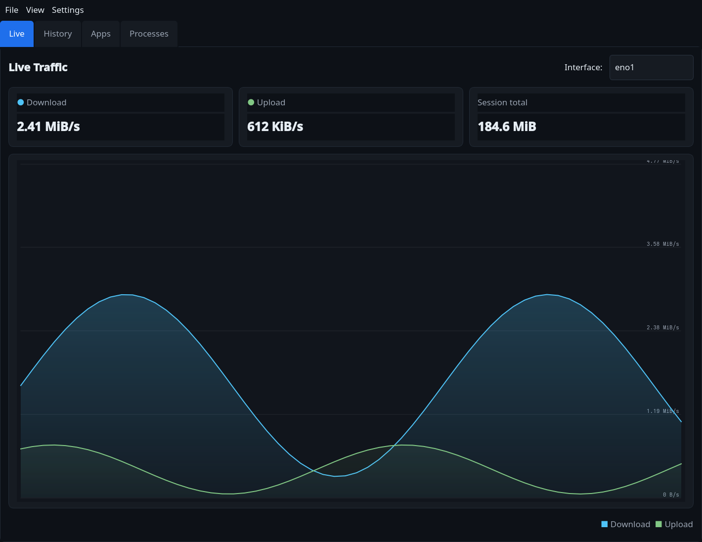
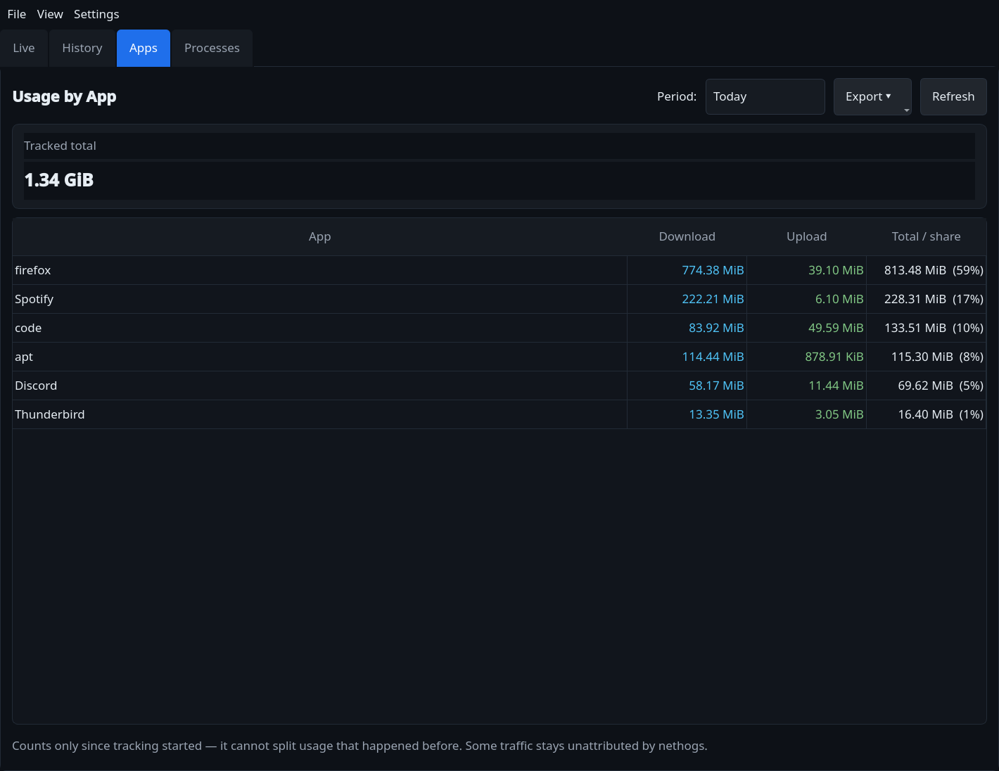
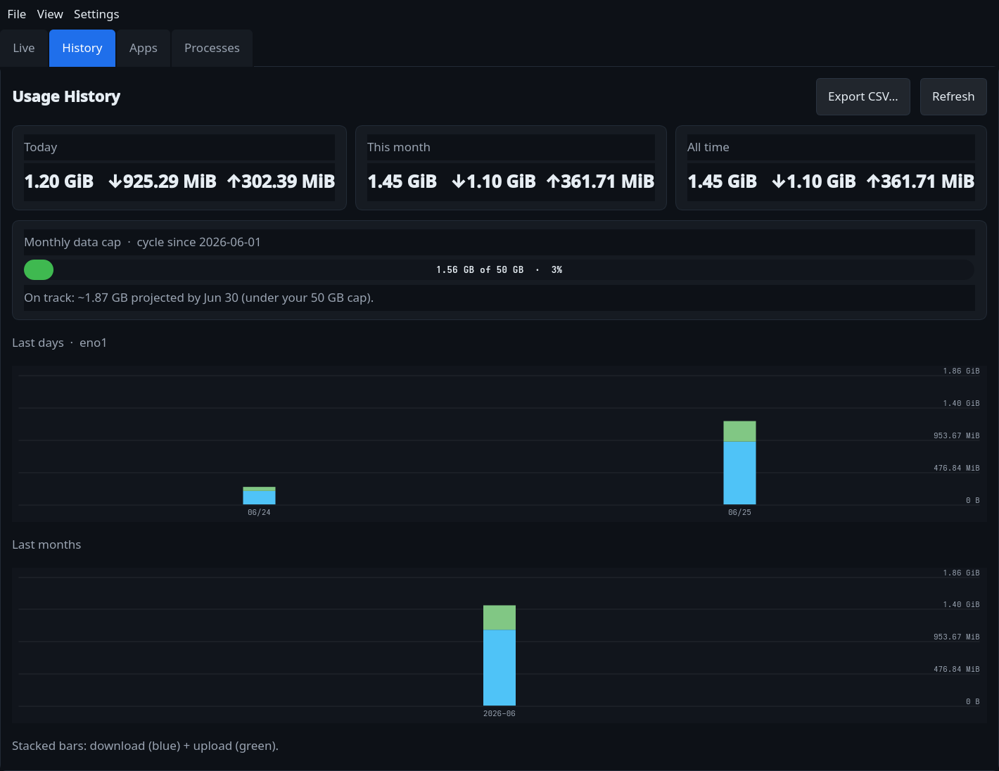
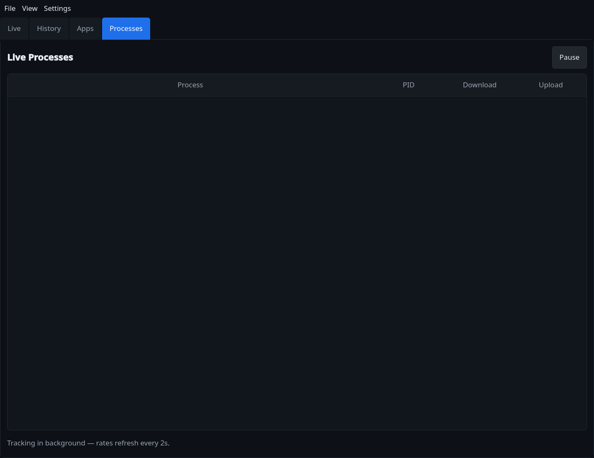

# NetTracker

A PyQt5 desktop app to track internet usage on Linux — **live speed**,
**vnstat history**, **per-app usage**, **monthly data caps**, and a **system
tray**, in a clean dark UI.

> Charts and the app/tray icon are drawn with `QPainter`, so there are **no
> charting dependencies** — only PyQt5.



## Features

| | |
|---|---|
| **Live** | Real-time download/upload speed, a scrolling 60-second graph, and session totals. Reads kernel counters from `/sys/class/net`, so **no root needed**. |
| **History** | Today / this-month / all-time totals plus stacked bar charts for the last 14 days and 12 months, from the `vnstat` database. |
| **Apps** | Per-app usage **totals** for today / this month (see below). |
| **Processes** | Live per-process download/upload **rates** via `nethogs`. |
| **System tray** | Live ↓/↑ in the tooltip; close-to-tray; left-click to show/hide. Optional **launch on login** + **start minimized**. |
| **Monthly data cap** | Set a GB limit + billing day; color-coded progress bar, **end-of-cycle forecast** (*"on pace to hit your cap on Jun 28"*), and notifications at 80% / 100%. |
| **Usage alerts** | Get notified when today's **total**, or any single **app**, passes a GB threshold you set. |
| **Export** | Save per-app usage (CSV/JSON) and daily history (CSV) for spreadsheets/reports. |
| **Units toggle** | Switch rate display between bytes/s and bits/s (Mbps). |
| **Persistent** | Remembers your interface, units, cap, alert, and tray settings between launches. |

### Per-app usage (Apps tab)

NetTracker keeps a lightweight `nethogs` sampler running in the background,
integrates each app's rate into bytes, and accumulates it in a local SQLite
database (`~/.local/share/nettracker/usage.db`). Toggle it under
**Settings ▸ Track per-app usage**.

> ⚠️ Per-app tracking only counts traffic **from when tracking starts** — Linux
> keeps no per-process history, so it cannot retroactively split usage that
> already happened. A little traffic (kernel, ICMP) stays unattributed by
> nethogs, so per-app totals run slightly under vnstat's interface total.



<details>
<summary>More screenshots — History &amp; Processes</summary>




</details>

## Requirements

- **Python 3.9+** and **PyQt5**
- **`vnstat`** (with its daemon running) — for the History / data-cap features
- **`nethogs`** — for the Apps and Processes tabs (optional)

```bash
# Fedora
sudo dnf install vnstat nethogs
# Debian / Ubuntu
sudo apt install vnstat nethogs
# Arch
sudo pacman -S vnstat nethogs

sudo systemctl enable --now vnstat   # start the vnstat daemon
```

## Install & run

```bash
git clone https://github.com/<you>/NetTracker.git
cd NetTracker

python -m venv venv
source venv/bin/activate
pip install -r requirements.txt

./run.sh          # or: python main.py
```

`run.sh` uses `$PYTHON` if set, otherwise falls back to `python3`.

## Per-app / per-process access

`nethogs` needs elevated capabilities to capture packets. The **Apps** and
**Processes** tabs show a **Grant access** button that runs this once via
`pkexec`:

```bash
sudo setcap 'cap_net_admin,cap_net_raw,cap_dac_read_search,cap_sys_ptrace+ep' \
    /usr/bin/nethogs
```

Afterwards NetTracker runs nethogs as your normal user — no `sudo` per launch.

## Menus & shortcuts

| Action | Where |
|--------|-------|
| Refresh history | `F5` or **View ▸ Refresh history** |
| Speed units (bytes/s ↔ bits/s) | **View ▸ Speed units** |
| Data cap & usage alerts | **Settings ▸ Data cap & alerts…** |
| Track per-app usage on/off | **Settings ▸ Track per-app usage** |
| Launch on login / start minimized | **Settings ▸ Launch on login / Start minimized** |
| Export usage | **Export** buttons on the History and Apps tabs |
| Quit (not just hide) | `Ctrl+Q`, **File ▸ Quit**, or the tray menu |

## Where data lives

| Path | Contents |
|------|----------|
| `~/.config/nettracker/settings.json` | Interface, units, data-cap config |
| `~/.local/share/nettracker/usage.db` | Per-app usage history (SQLite) |

History totals themselves come from the system `vnstat` database, not from
NetTracker.

## Project layout

| File | Purpose |
|------|---------|
| `main.py` | Entry point |
| `nettracker/app.py` | Main window, tabs, tray, menus, data-cap logic |
| `nettracker/sources.py` | Interfaces, `/sys` counters, vnstat JSON, billing cycle |
| `nettracker/nethogs.py` | nethogs monitor (QProcess) + capability handling |
| `nettracker/usagedb.py` | SQLite per-app usage accumulator |
| `nettracker/widgets.py` | `LiveGraph`, `BarChart`, `CapBar`, icon (QPainter) |
| `nettracker/settings.py` | Persistent JSON settings |
| `nettracker/autostart.py` | freedesktop autostart entry (launch on login) |
| `nettracker/export.py` | CSV / JSON writers |
| `nettracker/utils.py` | Byte/rate/GB formatting + unit toggle |

## License

MIT — see [LICENSE](LICENSE).
